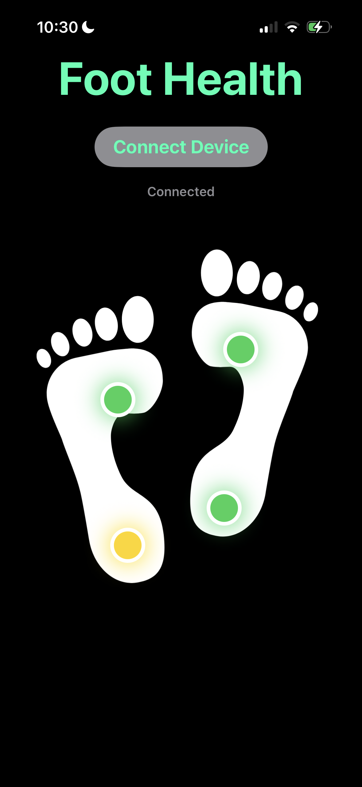
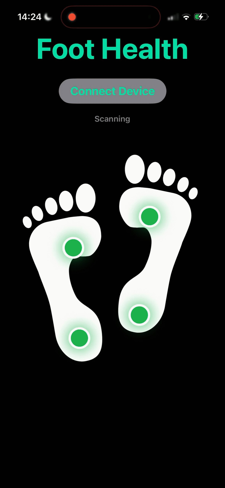
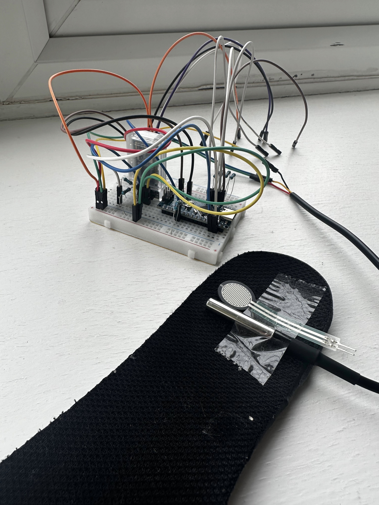
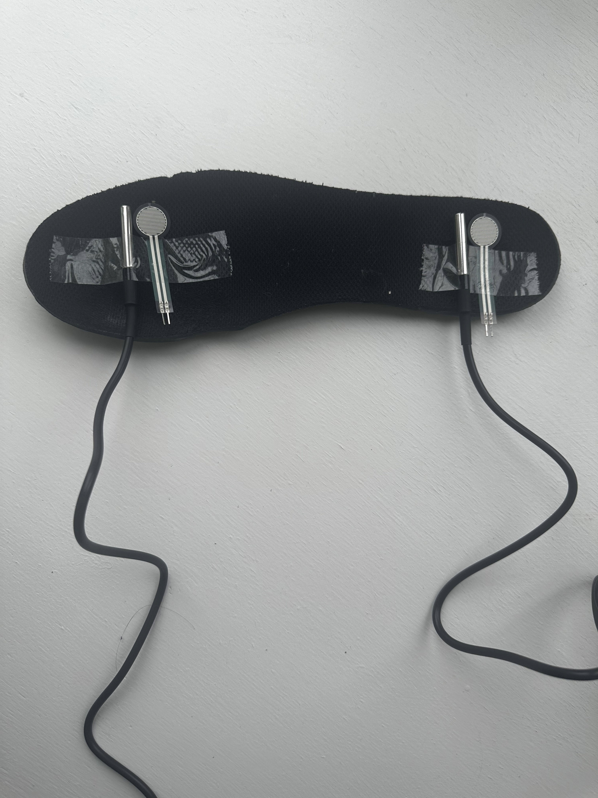

# Diabetics Smart Sock

## 📌 Overview
A wearable foot-monitoring prototype that uses pressure and temperature sensors to detect potential diabetic foot risk areas in real time. Sensor data is streamed from an Arduino-based smart sock over Bluetooth to an iOS app, where Core ML models predict risk levels for four foot regions: left heel, left ball, right heel, and right ball. The app visualises the predictions using colour-coded indicators over a foot diagram.

## App Demo

<table>
  <tr>
    <td>
      
    </td>
    <td>
      
    </td>
  </tr>
</table>

The following video shows the data collected by the smart sock being streamed to the app: 


> **Note:** Two temperature readings show `-127` because those sensors are not connected. This is why there is a warning saying temperature values look invalid

## Hardware

<table>
  <tr>
    <td>
      
    </td>
    <td>
      
    </td>
  </tr>
</table>

## Features

- Real-time Bluetooth data streaming from Arduino/HM-10 to iOS
- Pressure and temperature monitoring across four foot regions
- 30-sample sliding window feature extraction
- Four Random Forest classifiers exported to Core ML
- On-device risk prediction in the iOS app
- Colour-coded foot visualisation for localised risk feedback

## System Architecture

Arduino sensors -> HM-10 Bluetooth -> iOS app -> Core ML models -> foot risk LEDs

---
## Machine Learning

The original model predicted four outputs simultaneously. To make the model easier to integrate with Core ML on iOS, the pipeline was refactored into four separate Random Forest classifiers:

- `L_heel_risk`
- `L_ball_risk`
- `R_heel_risk`
- `R_ball_risk`

Each model uses the same 20 engineered features calculated over a 30-sample window. These include pressure and temperature means, standard deviations, and cross-foot differences.

The trained scikit-learn models are exported to Core ML so predictions can run directly on-device without requiring a server.

---

## iOS App

The iOS app connects to the smart sock over Bluetooth, receives live CSV sensor data, reconstructs complete readings from Bluetooth packets, calculates the required ML features, and runs the Core ML models locally.

Predicted risk values are displayed as four LEDs over a foot image:

- Green: low risk
- Yellow/orange: moderate risk
- Red/purple: higher risk

---
## 🔧 Hardware Setup
The smart sock prototype is built using Arduino-compatible sensors embedded into an insole.

### Sensors
- Temperature Sensors (4 total, 2 per foot)
    - Type:digital temperature sensor (DS18B20)
    - Positioned at heel and ball regions of each foot
    - Measures skin temperature at ~100 Hz
- Pressure Sensors (4 total, 2 per foot)
    - Type: Force Sensitive Resistor (FSR)
    - Positioned at heel and ball regions of each foot
    - Measures plantar pressure (arbitrary units) at ~1 Hz
## Electronics
- Microcontroller: Arduino Nano for sensor acquisition
- Bluetooth Module: HM-10 for wireless data transmission
- Resistors: Voltage divider resistors for analog sensors (thermistors, FSRs)
- Power: 5V from Arduino regulated supply


## 🧪 Science 

**High blood sugar** results in:

1. **poor circulation** (wounds heal slowly)
2. **nerve damage** (can't feel much)

A cut on the foot could easily get infected due to poor healing and spread uncontrollably. The only way to stop it in some cases is through **amputation**. If identified early, preventative methods can be put in place, however due to nerve damage, many don't catch this early enough.

Research shows that a **difference > 2.2C** between feet is a strong indicator of ulcer formation. In addition, pressure is a key indicator of the damage to the foot, as excessive amounts can damage the tissue further, reducing the likelihood of recovery.


By combining data from the sensors, we can automatically classify the level of risk for different parts of the foot (e.g., heel, ball).  
This project demonstrates how **wearable IoT sensors + ML** can provide early warnings, potentially preventing ulcer formation.

---

## 📂 Dataset
- Data collected from **temperature and pressure sensors** embedded in insoles (normal data).
- Data simulated for an individual at risk of foot ulcers, informed by established scientific evidence  
- Each foot is divided into **4 regions**:
  - Left Heel  
  - Left Ball  
  - Right Heel  
  - Right Ball  

- Raw data:  
  - Sampling frequency: ~100 Hz  
  - Collected for ~60 s per class  
  - Stored in CSV format  

- Features extracted per window:
  - **Mean & standard deviation** of pressure  
  - **Mean & standard deviation** of temperature  
  - **Cross-foot differences** (temperature & pressure imbalance)  

---

## 🏷 Risk Labelling
Risk categories were assigned using **domain-inspired rules**:

```python
if temp_diff > 2.2:
    if risk_pressure > 900:
        if risk_pressure - compare_pressure > 100:
            return 3  # imbalance + high temp difference
        else:
            return 4  # high pressure + significant temp difference
    else:
        return 3      # temp difference but pressure low
elif temp_diff > 1.1:
    if risk_pressure > 900:
        if risk_pressure - compare_pressure > 100:
            return 1  # moderate diff + imbalance
        else:
            return 2  # moderate diff + high pressure
    else:
        return 1      # moderate temp diff but low pressure
else:
    return 0          # no significant risk

```


## Limitations and Next Steps

This is a prototype and is not intended for medical diagnosis. Current limitations include sensor calibration,small/simulated training and lack of wearability

## Future Improvements

- Collect a larger real-world dataset across different users, foot sizes, walking patterns, and activity levels
- Improve sensor reliability, calibration, and handling of failed readings
- Add live charts for pressure and temperature trends in the iOS app
- Validate predictions against labelled test scenarios and expert-reviewed risk examples
- Reduce the size of the electronics and wiring to make the prototype wearable for everyday use
- Improve the physical sock enclosure so the sensors stay correctly positioned while walking
- Explore a smaller battery-powered design with safer cable routing and better comfort
